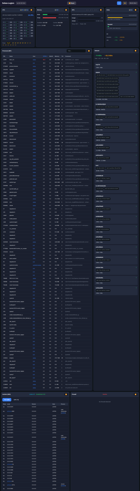

[English](README.md) · **Español**

# Syspeek

Monitor de sistema en tiempo real con interfaz web. Como `top` o `htop`, pero en el navegador y con referencias cruzadas clickeables entre procesos, usuarios, conexiones de red y más.



## Características

- **Procesos**: Lista todos los procesos en ejecución con uso de CPU/memoria, ordenable y filtrable. Click en un usuario para ver todos sus procesos, o en un PID para ver sus conexiones de red.
- **Sockets**: Todas las conexiones TCP/UDP con direcciones local/remota. Click en una IP para geolocalización y whois, o en un PID para saltar al proceso.
- **CPU**: Uso por core en tiempo real con histograma.
- **Memoria**: Uso de RAM y swap con desglose.
- **Disco**: Uso de cada filesystem y estadísticas de I/O.
- **Red**: Tráfico por interfaz con gráficos de bandwidth en vivo.
- **GPU**: Stats de GPU NVIDIA (si está disponible).
- **Firewall**: Reglas de iptables/nftables (Linux) o estado del Firewall de Windows.

### Referencias cruzadas

La característica principal son los **links clickeables en todos lados**:
- Click en un PID en la vista de sockets → salta a ese proceso
- Click en un usuario → filtra procesos por ese usuario
- Click en una IP → muestra geolocalización, hostname, whois
- Click en un puerto → muestra qué servicio lo usa típicamente

Todo está interconectado, facilitando investigar "¿qué está usando mi red?" o "¿qué procesos tiene este usuario?".

## Instalación

### Linux / macOS

```bash
git clone https://github.com/neitanod/syspeek.git
cd syspeek
./build
# Opcional: instalar en el sistema
sudo ln -sf $(pwd)/syspeek /usr/bin/syspeek
```

### Windows (PowerShell)

```powershell
git clone https://github.com/neitanod/syspeek.git
cd syspeek
.\build.ps1
.\run.ps1 -p
```

### O instalar con un agente de IA

Si usás un agente con acceso a tu terminal (Claude Code, Cursor, etc.), pegale
este prompt y dejá que instale todo por vos:

<https://github.com/neitanod/syspeek/blob/main/install_prompt.md>

## Uso

```bash
# Abre el navegador automáticamente en puerto 9876
syspeek

# Modo servidor (sin abrir navegador, útil para acceso remoto)
syspeek --serve

# Modo público de solo lectura (sin auth, útil para la primera prueba)
syspeek -p

# Puerto personalizado
syspeek --port 8080

# Con archivo de configuración
syspeek --config-file config.json
```

Si el puerto 9876 está ocupado, automáticamente prueba el siguiente (hasta 50 intentos).

## Configuración

Copiar `config.example.json` a `~/.config/syspeek/config.json`
(en Windows: `%USERPROFILE%\.config\syspeek\config.json`):

```json
{
  "server": {
    "host": "0.0.0.0",
    "port": 9876
  },
  "auth": {
    "username": "admin",
    "password": "tu-password"
  },
  "ui": {
    "title": "Mi Servidor",
    "theme": "dark"
  }
}
```

La autenticación es opcional. Sin ella (o en modo `-p`), la interfaz es solo lectura (no se pueden matar procesos).

## Requisitos

- Linux (lee de `/proc`), macOS o Windows 10+
- Go 1.21+ (para compilar)
- Drivers NVIDIA (opcional, para stats de GPU)

### Notas sobre el backend de Windows

Los collectors de Windows usan una mezcla de Go nativo (vía `gopsutil`) e
invocaciones a PowerShell con WMI (para memoria, servicios, usuarios, firewall
y GPU). El cold-start de PowerShell agrega unos segundos a la primera lectura
de cada panel; las lecturas siguientes se sirven desde un cache in-process con
TTL corto, así que las actualizaciones en vivo se ven igual que en Linux.

## Licencia

MIT
