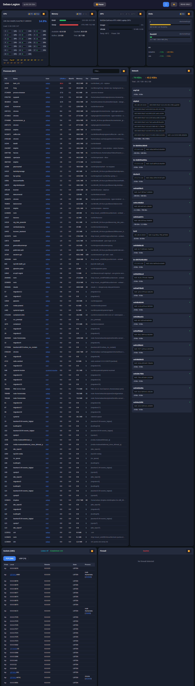

# Syspeek

Real-time system monitor with a web interface. Like `top` or `htop`, but in your browser with clickable cross-references between processes, users, network connections, and more.



## Features

- **Processes**: View all running processes with CPU/memory usage, sorted and filterable. Click on a user to see all their processes, or on a PID to see its network connections.
- **Sockets**: See all TCP/UDP connections with local/remote addresses. Click on an IP to get geolocation and whois info, or on a PID to jump to the process.
- **CPU**: Real-time CPU usage per core with historical chart.
- **Memory**: RAM and swap usage with breakdown.
- **Disk**: Filesystem usage and I/O stats.
- **Network**: Interface traffic with real-time bandwidth graphs.
- **GPU**: NVIDIA GPU stats (if available).
- **Firewall**: View iptables/nftables rules.

### Cross-referencing

The key feature is **clickable links everywhere**:
- Click a PID in sockets view → jumps to that process
- Click a user → filters processes by that user
- Click an IP address → shows geolocation, hostname, whois
- Click a port → shows what service typically uses it

Everything is interconnected, making it easy to investigate "what's using my network?" or "what processes does this user have?".

## Installation

```bash
# Clone and build
git clone https://github.com/neitanod/syspeek.git
cd syspeek
go build -o syspeek .

# Optional: install system-wide
sudo ln -sf $(pwd)/syspeek /usr/bin/syspeek
```

## Usage

```bash
# Opens browser automatically on port 9876
syspeek

# Server mode (no browser, useful for remote access)
syspeek --serve

# Custom port
syspeek --port 8080

# With config file
syspeek --config-file config.json
```

If port 9876 is busy, it automatically tries the next port (up to 50 attempts).

## Configuration

Copy `config.example.json` to `~/.config/syspeek/config.json`:

```json
{
  "server": {
    "host": "0.0.0.0",
    "port": 9876
  },
  "auth": {
    "username": "admin",
    "password": "your-password"
  },
  "ui": {
    "title": "My Server",
    "theme": "dark"
  }
}
```

Authentication is optional. Without it, the interface is read-only (can't kill processes).

## Requirements

- Linux (reads from `/proc`)
- Go 1.21+ (for building)
- NVIDIA drivers (optional, for GPU stats)

## License

MIT

---

# Syspeek (Español)

Monitor de sistema en tiempo real con interfaz web. Como `top` o `htop`, pero en el navegador y con referencias cruzadas clickeables entre procesos, usuarios, conexiones de red y más.

### Referencias cruzadas

La característica principal son los **links clickeables en todos lados**:
- Click en un PID en la vista de sockets → salta a ese proceso
- Click en un usuario → filtra procesos por ese usuario
- Click en una IP → muestra geolocalización, hostname, whois
- Click en un puerto → muestra qué servicio lo usa típicamente

Todo está interconectado, facilitando investigar "¿qué está usando mi red?" o "¿qué procesos tiene este usuario?".

## Instalación

```bash
# Clonar y compilar
git clone https://github.com/neitanod/syspeek.git
cd syspeek
go build -o syspeek .

# Opcional: instalar en el sistema
sudo ln -sf $(pwd)/syspeek /usr/bin/syspeek
```

## Uso

```bash
# Abre el navegador automáticamente en puerto 9876
syspeek

# Modo servidor (sin navegador, útil para acceso remoto)
syspeek --serve

# Puerto personalizado
syspeek --port 8080

# Con archivo de configuración
syspeek --config-file config.json
```

Si el puerto 9876 está ocupado, automáticamente prueba el siguiente (hasta 50 intentos).

## Configuración

Copiar `config.example.json` a `~/.config/syspeek/config.json`:

```json
{
  "server": {
    "host": "0.0.0.0",
    "port": 9876
  },
  "auth": {
    "username": "admin",
    "password": "tu-password"
  },
  "ui": {
    "title": "Mi Servidor",
    "theme": "dark"
  }
}
```

La autenticación es opcional. Sin ella, la interfaz es solo lectura (no se pueden matar procesos).

## Requisitos

- Linux (lee de `/proc`)
- Go 1.21+ (para compilar)
- Drivers NVIDIA (opcional, para stats de GPU)

## Licencia

MIT
